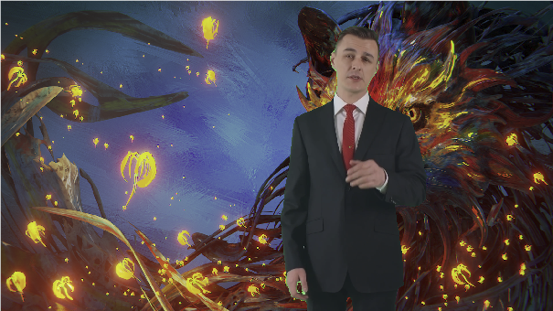
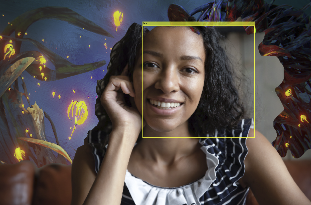

# Aplicación de segmentación de fotos.

En este repositorio se incluye una aplicación implementada en Matlab capaz de segmentar el fondo de una imagen mediante dos técnicas: croma y detección de caras.

## Instalación

Se incluye un fichero ejecutable en el último *release*. Para ejecutarlo es necesaria la versión *Matlab R2020b* y los *toolboxes* siguientes:

- *Computer Vision Toolbox*
- *Image Acquisition Toolbox*
- *Image Processing Toolbox*

## Resultados

*Resultado con croma*

*Resultado con detección de cara*
